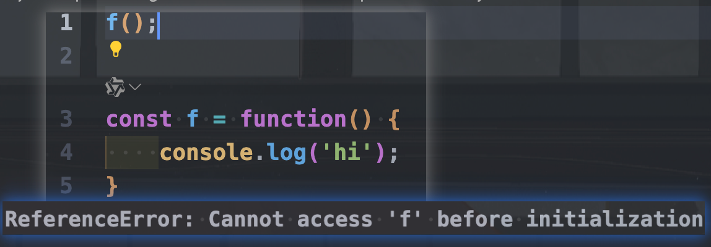

```
这一章学了一些高级的函数以及一些api
anonymous function: 当使用变量存储一个函数时，函数名可以省略（因为用不到了）
const f = function() {}

其实先前一直在写的 
function f() {
    ...
}
就是
const f = function() {
    ...
}
的缩写
但是使用 function f() {...}的好处是可以Hoisting,就是不论你这个函数定义在哪里，都可以call
但使用const f = function() {...}就不行
```

```
pass a function into another function as a parameter is called callback function
It will be called soon or later

Asynchronous Code: It will not block
Synchronous Code: Wait till finished and then go to the next line

there is no break for forEach(value,index), use for if you want to use break
but you can use an if statement with return to make it behaves like continue 
for each value inside the array, forEach will create a function to deal with, and if we return, it will quit the function and deal with the next value with a function
```