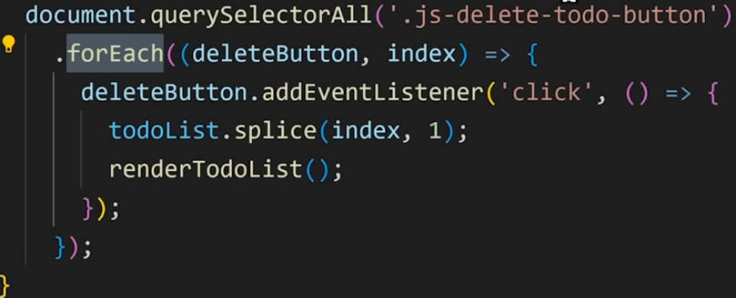

```
这一章继续学习了更高级的特性
有点意思的是我刚刚听到一半才发现没开字幕，双语都没开
哈哈哈哈哈哈
里面比较有意思的是，如何使用不同的函数表示方法，这里又介绍了箭头函数，箭头函数一般用在比如回调函数那里，或者是用变量接收的时候用在等号后面，反正都没法Hoisting
但是想要可读性更好，除了上面的两种情况，一般就正常的 function f() {...}就行，同时还能Hoisting
在object就别用箭头函数了，直接f() {...}更好

对于一些需要回调函数的，有时候你直接把另一个函数传进去是不行的，因为这个函数会被立即执行然后返回它的返回值，不符合我的回调的想法了，所以要在外层套一个函数，这时候用箭头函数就是极佳的选择

```

```
这个就是很经典的这章的浓缩代码
两个api
filter,map，都会创建一个新数组然后进行一些操作来返回这个处理过的新数组
过滤器把每个值拿过来，可以写一写判断，返回true就保留，返回false就删掉
map也是把每个值拿出来，可以写一些对这些值的操作，然后把这个操作后的值加到新数组里,如果你直接返回一写自己的值也可以的，反正它会把此次的返回添加到新数组中，最后返回新数组(transform an array into another array)

这里刚开始听到closure的时候不知道是啥，后来看了说明和例子反应过来是闭包
if a function has access to a value
it will always have access to that value
value gets packaged together(enclosed) with the function
感觉和scope那里蛮像的,但是应该细节上不太一样，后续专门看一下闭包的视频吧

```