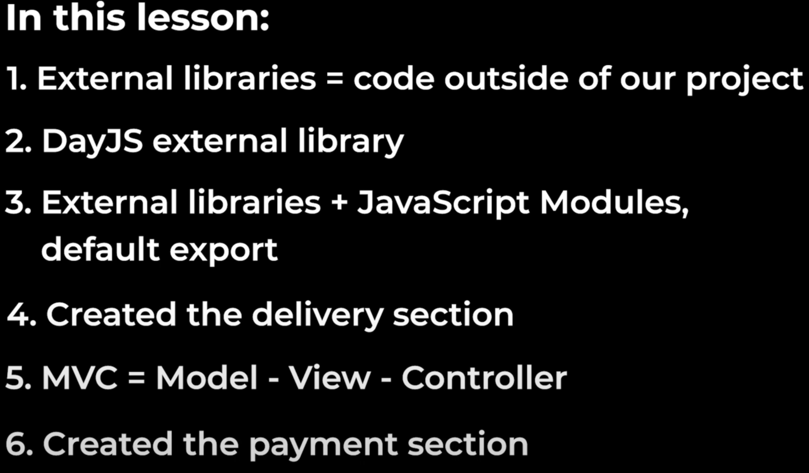

```
Before 14:52:50
在这之前学习了如何从Internet上导入js
先是使用最基础的script方式
然后接受了ESM Version ： EcmaScript Module
EcmaScript = JavaScript ， 就是ES6里面的ES
ESM Version is a version that works with JavaScript Modules
这里也介绍了Default Export，就是一个js文件只导出一个？？，好吧我也形容不来这个名词，可以是一个function，也可以是variable
Default Export is another way of exporting
Named Export {...,...};
还一个就是之前因为localStorage没有处理好，数据出错了每次都手动的去清缓存，其实可以在console里
localStorage.clear();
```

```
Before 14:57:03
这里引入了一个A function can call/re -run itself = recursion
```

```
IMPORTANT!!!

Before 15:00:19
这里介绍了MVC(Model - View - Controller)
在这之前，在每次更新数据后重新生成html
过程是:
1.Update the data
2.Regenerate all the HTML => MVC (Model => View => Controller => Model => ......)

MVC split our code into 3 parts
1.Model: saves and manages the data (store the data and offer some function to deal with the data)
2.View: takes the data and display it on the page (there are some listeners on the page, we can interact with it and it will run the code, the code is controller)
3.Controller: run some code when we interact with the page (it may update the data which Model saves and manages) => Next Loop

MVC makes sure the page always matches the data
MVC is a design patterns(设计模式)
```

