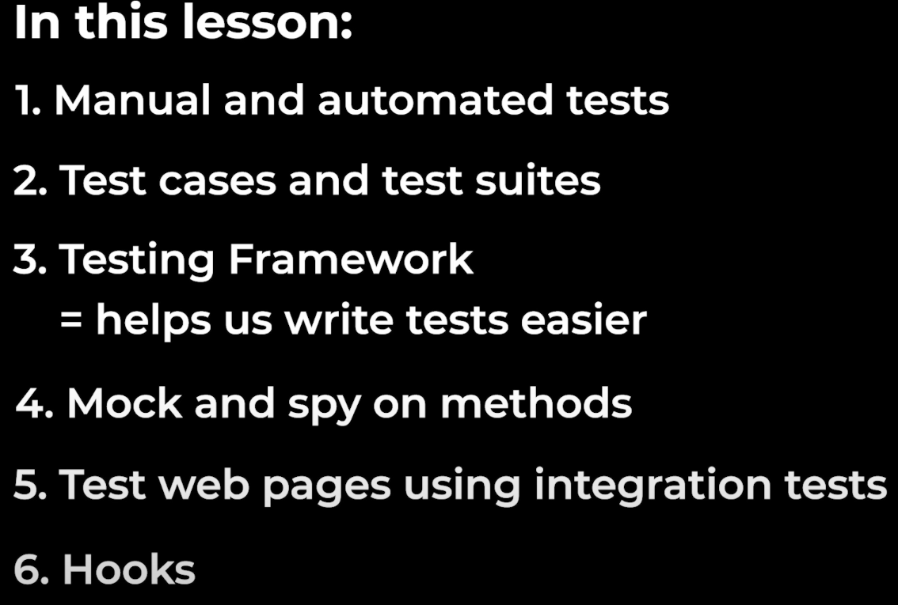

```
Before 15:58:24
学习了测试
Manually Test: not recommended
Automated Test : using code to test code;
like
test suit : ???(the function or something u want to test)

test case1(Basic test case) => to test if the code is working
passed / failed

test case2(Edge) => test tricky/special cases
...
...

try to cover as much as cases
```

