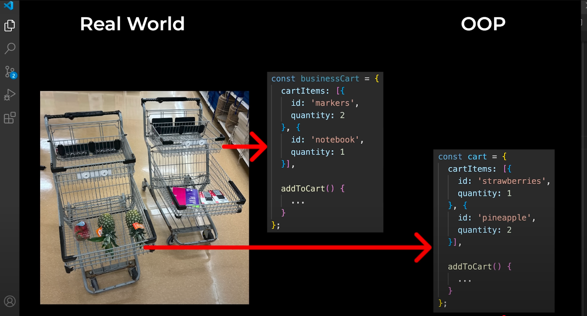

```
又是老朋友了，在之前写代码的时候我根本没想起过它
这个组织代码的方式真的是妙哉
课程也很循序渐进，生动形象
在之前使用的都是Procedure Programming:
Procedure: a set of step by step instructions => a function
现在使用Object Oriented Programming(OOP):
Organize our code into objects
and easy to create multiple object
```


```
很生动形象吧哈哈哈
在使用class的时候,use the PascalCase for things that generate objects
```

```
正式引入Class，原来上面的还不是class，只是使用函数来表现出Class的作用
但是很明显Class有更多的features like constructor
Class helps us generate objects
it is the better way!
Constructor helps us run some setup code
Constructor has to be named constructor and no return anything
```

```
听说过private但是没听说过用一个#(number sign / hash)去修饰
Private = it can only be accessed inside the class
在报错信息里有一个单词field 这个和property是一样的
```

```
Inheritance: Lets us reuse code between classes
If we want to new different type, we can use discriminator property
Polymorphism: use a method without knowing the class
Override the method: override/replace the parent's method
```

```
Built in classes = classes that are provided by the language
在product.js里有一写关于this的练习可以查看
```
```
1.inside a function, we can change "this" to whatever we want
```


```
2.Arrow functions do not change the value of "this"
```

```
"this" will have the same value as outside the arrow function
```

```
3."this" keeps the value that it had outside the arrow function
```

```
that's why developer design arrow function to behave like this
```
```
Summary of "this"
```
