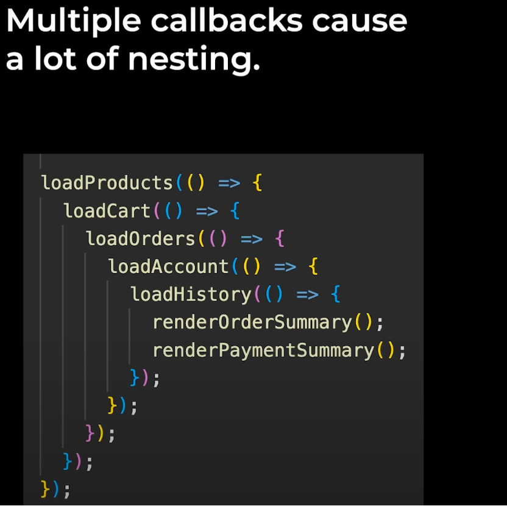

```
终于进入了一个我之前没有详细学习过的知识部分
XMLHttpRequest: This is a built-in class(Provided by JavaScript)
method:GET => get some information from the backend
```


```
Status Code
```


```
Backend API(Application Programming Interface)
Interface: How we interact with something
```


```
use browser to send GET request
```


```
Promises:
- better way to handle asynchronous code 
- similar to done() function => done() is provided by the test framework Jasmine
- let us wait for some code to finish before going to the next step
```

```
resolve() :
- similar to done() function
- lets us control when to go to the next step
```


```
Multiple callbacks cause a lot of nesting!!!
```



```
Promise.all() :
- lets us run multiple promises at the same time
- and wait for all of them to finish
```

```
fetch() : better way to make HTTP requests
```

```
!!!IMPORTANT
Async Await:
even better way to handle asynchronous code
```

```
Async await is a shortcut for promises
```

```
async = makes a function return a promise
```
;


```
The point of async feature is that async lets us ues await
```

```
await:
lets us wait for a promise to finish, 
before going to the next line.
```


```
we can only use await, when we're inside an async function.
But the closest function has to be async function.
```

```
async await can only be used with promises.
```

```
It's easier to save value
```
